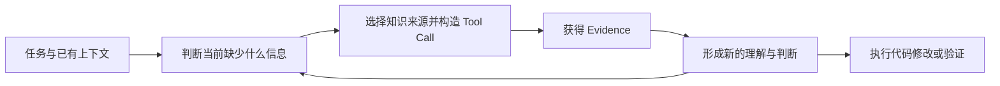
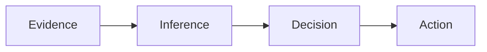
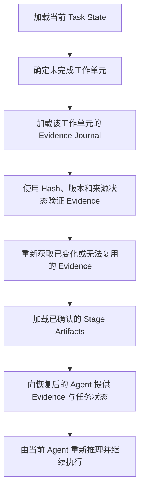

# Evidence-Guided Recovery：AI Coding Agent 的低风险上下文恢复机制

## 引言

随着 Claude Code、Codex、Cursor 等 AI Coding Agent 被用于越来越复杂的软件工程任务，一个此前并不明显的问题开始逐渐显现：当 Agent 在长任务执行过程中发生进程崩溃、上下文压缩、会话终止、用户主动中断或其他异常情况时，系统应当如何恢复工作，并尽可能减少此前已经投入的时间、Token 和工具调用成本。

目前，业界针对长时间运行 Agent 的恢复机制，主要集中在 Workflow Recovery 或 Durable Execution 层面。典型方案通过 Checkpoint、状态持久化、任务状态记录和执行重放，使 Agent 能够在中断后继续执行尚未完成的步骤。

这些机制主要回答一个问题：

> Agent 已经执行到了哪里？

然而，在 AI Coding 场景中，仅仅恢复任务进度，并不等于恢复 Agent 的有效工作状态。Agent 在开始修改代码之前，通常需要阅读代码文件、搜索调用关系、查询项目文档、访问 MCP 服务、检索 RAG 知识库，并运行测试或诊断命令。这些知识探索活动可能消耗大量时间、Token 和工具调用次数。

当 Agent 中断后，即使系统知道当前任务尚未完成，恢复后的 Agent 仍然可能需要重新寻找入口文件、重新构造搜索请求、重新查询资料，并重新建立对当前任务相关知识来源的认识。

因此，在 Task Recovery 之外，还存在一个值得单独讨论的问题：

> 在无法可靠恢复 Agent 推理状态的情况下，系统能否恢复此前知识探索过程中已经获得的高确定性成果，从而减少重复探索成本？

本文将这种机制称为 **Evidence-Guided Recovery，即基于证据轨迹的恢复**。

它并不试图恢复 Agent 曾经形成的完整理解，也不试图替代恢复后的模型进行判断。它保存并恢复的是 Agent 在任务上下文驱动下访问过的知识来源、使用过的查询参数以及获得的工具结果，使恢复后的 Agent 能够基于这些 Evidence 重新推理并继续工作。

## AI Coding 中的知识探索成本

AI Coding Agent 的主要工作并不只是生成代码。对于真实项目中的复杂任务，Agent 往往首先需要回答一系列与项目上下文相关的问题，例如：

- 功能入口位于哪个模块；
- 某个接口由哪些组件调用；
- 项目的认证、权限或数据模型如何设计；
- 当前需求受到哪些业务规范约束；
- 应当运行哪些测试验证修改；
- 某个错误可能涉及哪些依赖或历史实现。

为了回答这些问题，Agent 会持续执行文件读取、代码搜索、文档检索、MCP 调用、RAG 查询和测试命令。这些调用并不是对项目内容的随机遍历，而是由当前任务、已有上下文和此前工具结果共同驱动的连续知识探索过程。

一个典型过程可以表示为：



在这个过程中，真正不可直接观察的是模型内部如何从 Evidence 形成理解和决策。但是，模型对知识来源的选择已经通过 Tool Call 外化出来。

例如，读取某个文件意味着 Agent 判断该文件可能与当前任务相关；搜索某个关键词意味着 Agent 已经形成了特定的知识需求；查询某个 MCP 服务意味着 Agent 判断该服务可能包含所需信息；运行某个测试则意味着 Agent 判断该测试能够验证当前实现或假设。

因此，Tool Call Journal 不只是普通的执行日志。它同时记录了 Agent 在特定任务上下文下形成的一部分探索决策。

## Task Recovery 的能力与局限

在实际使用 AI Coding Agent 时，开发者已经自然形成了一些轻量级的 Task Recovery 实践，例如将大任务拆分为多个子任务、使用 Checklist 管理状态、在阶段完成后更新任务状态，以及在中断后从未完成任务继续执行。

例如，一个任务可能被拆分为：

- 分析登录流程；
- 阅读组件和认证文档；
- 实现登录逻辑；
- 执行测试；
- 提交已完成修改。

当 Agent 中断后，系统可以通过 Checklist 判断哪些工作已经完成，哪些工作仍未完成。

这种机制能够回答：

> Agent 做到了哪里？

但是，它无法回答：

> Agent 为完成当前任务已经寻找过哪些信息，又从哪些来源获得了相关 Evidence？

如果系统只恢复任务状态，恢复后的 Agent 仍然可能重复执行大量此前已经完成的知识探索工作，包括重新定位文件、重新搜索关键词、重新查询文档以及重新确定验证命令。

因此，Task Recovery 只能恢复工作流位置，无法独立降低上下文重建过程中的重复探索成本。

## 为什么不恢复推理状态

最理想的恢复方式似乎是直接恢复 Agent 的推理状态，使其能够完整继承中断前形成的理解和决策。然而，在当前 Agent Runtime 中，这种状态通常无法被稳定、完整且可信地获取。

Agent 的工作过程可以简化为：



其中，Evidence 通常可以通过工具输入和工具结果获得；Action 可以通过工具调用和代码修改观察；但 Inference 通常不会以稳定、结构化的方式暴露，而 Decision 也不一定会被明确记录。

一种常见补救方案是使用额外模型生成 Summary、Decision Log 或长期 Memory，以保存此前形成的重要理解。这类方案能够显著压缩上下文，但也引入了新的智能可信问题。

自动生成的 Summary 可能遗漏关键信息、错误解释 Evidence、混淆事实与假设，或者在项目变化后继续保留已经过期的判断。一旦这些内容在恢复时被作为可靠前提重新注入上下文，错误就可能持续影响后续决策，并形成难以发现的静默污染。

此外，Agent 的理解会随着对话、工具调用和代码修改不断变化。某个时刻形成的中间判断，可能在下一次文件读取或测试执行后被推翻。因此，即使能够定期生成推理摘要，也很难确定合适的提取时机，并持续维护其有效性和一致性。

基于这些限制，本文不尝试恢复 Agent 的内部推理状态，也不尝试使用额外智能机制推断哪些历史结论应当被继续采用。

恢复后的 Agent 应当保留重新理解 Evidence、重新形成假设并重新进行决策的权利。

## Tool Call 作为知识探索轨迹

虽然无法可靠恢复内部推理，但 Agent 的 Tool Call 已经保留了部分与知识探索有关的外化决策。

例如：

- 文件读取路径反映了 Agent 对相关模块的判断；
- 代码搜索关键词反映了 Agent 当前关注的概念和调用关系；
- MCP 或 RAG 查询参数反映了 Agent 对缺失知识的描述；
- 工具调用顺序反映了 Agent 的调查路径；
- 测试和诊断命令反映了 Agent 对风险点和验证方式的判断。

这些记录并不能说明 Agent 最终得出了什么结论，也不能证明此前的探索路径一定正确。但是，它们可以说明：

> 此前的 Agent 在执行当前任务时，曾判断这些知识来源值得访问，并获得了对应的工具结果。

真实软件项目中的知识分布通常具有较强稳定性。某个 Bug 所涉及的调用链、某项功能对应的模块、某个接口的定义位置，以及某类业务规则所在的文档，通常不会因为 Agent 会话中断而随机变化。

在任务、代码版本和运行环境近似相同的情况下，一个重新开始探索的 Agent，大概率仍然会搜索相似的关键词、读取相似的入口文件、沿着相似的依赖关系继续调查，并运行相似的测试。

因此，保存 Tool Call 及其结果，可以减少恢复后重新识别知识需求、重新定位来源、重新构造查询和重新获取 Evidence 的成本。

这种机制并不需要解释 Tool Call 为什么重要，也不需要将工具结果转换为结论。历史探索轨迹只为恢复后的 Agent 提供知识输入和调查起点，后续推理仍然由当前模型完成。

## 从 Fact Recovery 到 Evidence Recovery

将该机制称为 Fact Recovery 并不完全准确，因为 Tool Result 本身不一定代表永久有效的事实。

例如：

- 文件内容可能在中断后发生变化；
- 测试结果可能受到环境和依赖状态影响；
- 外部文档和知识库内容可能已经更新；
- 搜索结果可能存在遗漏；
- 某次工具调用可能基于错误方向产生。

系统能够可靠保存的是：

> Agent 曾经访问过哪些来源、使用过哪些参数，以及当时获得了什么结果。

这些内容更适合被称为 Evidence，而不是 Fact。

Evidence 的价值不在于它一定正确，而在于它具有明确来源、能够追溯，并且通常可以通过文件 Hash、版本信息、时间戳和重新调用进行验证。

因此，本文采用 Evidence Recovery 作为更加准确的概念，并将恢复目标定义为：

> 恢复当前任务相关的知识探索轨迹和可验证输入，而不是恢复历史 Agent 对这些输入形成的理解。

## 工作流约束是恢复相关性的来源

如果系统记录一个长期会话中的全部 Tool Call，恢复时可能面对大量无关查询、错误探索和临时调试信息。此时，系统必须判断哪些 Evidence 与当前任务相关，而这又会引入新的智能选择和可信问题。

为了避免这一问题，Evidence-Guided Recovery 不依赖智能化的相关性判断，而是通过工作流约束提前限制恢复范围。

其基本要求包括：

- 将大型工作拆分为粒度适当、目标明确的子任务；
- 一个工作单元只处理相对集中的问题；
- 子任务完成后及时执行验证、确认状态并提交 Git；
- 已完成且已经提交的工作不再属于当前恢复范围；
- 当前未完成或未提交的工作单元构成恢复边界。

在这种工作流下，当前未完成任务中的 Tool Call Journal 天然具有较高相关性。恢复系统无需判断整个历史记录中哪些内容最重要，只需要恢复当前工作单元内已经发生的知识探索活动。

Git Commit 可以作为阶段成果完成的重要边界。已经完成并提交的代码修改、测试结果和阶段性产物，可以通过 Git 历史和工作流状态恢复。当前未提交工作则代表尚未完成的工作单元，其对应的 Evidence Journal 是恢复时最需要关注的范围。

对于没有产生代码提交的调查、设计或文档任务，还可以使用显式的工作单元完成标记建立相同边界。

这意味着方案的相关性并不来自恢复系统的智能筛选，而来自任务拆分和阶段确认所建立的确定性约束。

## Evidence-Guided Recovery 的三层结构

完整方案可以分为三个恢复层次。

### 第一层：Task Recovery

Task Recovery 保存当前工作单元的基本状态，包括：

- Task ID；
- 工作目标；
- Checklist；
- 当前状态；
- 已完成和未完成步骤；
- 当前 Git 基线与工作区状态；
- 显式的阶段完成标记。

这一层回答：

> 当前工作单元执行到了哪里？

Task Recovery 决定恢复范围，并防止系统重新处理已经完成且确认过的阶段成果。

### 第二层：Evidence Recovery

Evidence Recovery 保存当前工作单元中的知识探索轨迹，包括：

- Tool 名称与调用时间；
- Tool 输入参数；
- Tool Result；
- 结果来源；
- 文件路径与文件 Hash；
- 仓库 Commit ID；
- 外部来源版本与时间信息；
- Tool Call 的成功、失败和取消状态；
- 必要时重新获取 Evidence 的 Replay Recipe。

这一层回答：

> 此前为了执行当前任务，Agent 查询过哪些知识来源，并获得了什么结果？

恢复时，系统可以通过确定性规则处理 Evidence，例如对相同文件读取去重、校验文件 Hash、对已经变化的来源重新获取，并标记无法验证或已经过期的结果。

这些处理不需要判断 Evidence 的语义重要性，也不需要解释其内容。

### 第三层：Stage Artifact Recovery

Stage Artifact Recovery 保存已经明确形成并经过确认的工作流产物，包括：

- 用户确认的需求或 Spec；
- 已批准的 Plan；
- ADR；
- Review 结果；
- 测试报告；
- 已提交代码；
- 其他显式确认的阶段成果。

这一层回答：

> 哪些成果已经被明确形成、确认并成为后续工作的约束？

Stage Artifact 与自动生成的 Summary 不同。它们本身就是工作流产物，拥有明确的生成时机、责任边界和确认状态，因此可以作为恢复后的可靠输入。

## 恢复过程

一次典型恢复可以按照以下过程进行：



恢复系统不应向 Agent 声明历史 Evidence 证明了什么，也不应要求 Agent 继续采用此前可能存在的假设或方案。

它只需要准确表达：

> 此前 Agent 在执行当前任务时，曾经查询以下来源；这些是对应输入、结果和当前有效性状态。

恢复后的 Agent 可以重新阅读 Evidence、质疑此前的调查路径、补充新的查询，并根据当前环境形成新的决策。

## 方案所优化的成本

AI Coding 中的知识获取成本可以进一步拆分为：

```text
知识获取成本
=
知识需求识别
+ 知识来源定位
+ 查询构造
+ 来源获取
+ 内容理解
+ 推理与决策
```

Evidence-Guided Recovery 可以复用或部分复用：

- 已经外化的知识需求；
- 知识来源定位结果；
- 查询参数和调用方式；
- 来源获取结果；
- 调查顺序和验证入口。

它有意不复用：

- 对 Evidence 的内部理解；
- 未确认的历史假设；
- 方案选择；
- 决策理由；
- 后续行动判断。

因此，该方案不能消除 Agent 从 Evidence 到 Decision 的重新推理成本，也不能保证恢复后完全避免新的知识探索。

它最确定能够减少的是：

> 在恢复过程中重新发现、重新定位、重新查询和重新获取相关知识来源的成本。

这一部分成本在涉及大型代码库、内部文档、MCP 服务和 RAG 知识库的复杂任务中可能相当显著，并且具有较高重复概率和较强可验证性。

## 为什么不进行智能筛选与摘要

恢复时对 Evidence 进行智能排序、摘要或相关性筛选，可能进一步降低 Token 消耗。但是，这些机制会重新引入本文希望避免的问题。

智能筛选可能错误移除关键 Evidence，智能摘要可能改变原始含义，而相关性判断也可能受到恢复时缺失上下文的影响。由于这些处理结果会进入后续决策链，它们造成的错误通常比重复读取更加严重。

因此，当前方案选择使用工作流边界限制 Evidence 数量，并只使用确定性规则处理恢复记录。

可以接受的确定性处理包括：

- 对完全相同的调用进行去重；
- 对同一文件保留与当前版本对应的读取结果；
- 使用 Hash 判断文件是否变化；
- 对动态来源进行重新调用；
- 标记失败、取消和过期结果；
- 保留原始来源和调用顺序。

这些操作处理的是 Evidence 的身份、版本和有效性，而不是对其语义价值进行智能判断。

该方案的目标不是最大化恢复速度，而是在不引入新的智能可信问题的前提下，以较低风险减少重复知识探索成本。

## 与完整 Session Resume 和长期 Memory 的区别

完整 Session Resume 通常保存并重新加载历史对话、模型回复、工具调用和工具结果。它能够尽可能保持会话连续性，但也可能恢复大量已经过期、无关或错误的中间判断。

长期 Memory 或自动 Summary 则试图从历史会话中提取重要理解，并以更低 Token 成本提供跨会话连续性。这类机制具有较高压缩效率，但依赖额外模型判断什么值得保存、如何表达以及何时更新。

Evidence-Guided Recovery 采用不同的信任模型：

| 机制 | 主要恢复内容 | 是否依赖智能提取 | 主要风险 |
|---|---|---:|---|
| Task Recovery | 工作流状态 | 否 | 丢失知识探索成果 |
| 完整 Session Resume | 全部会话上下文 | 否或较少 | 上下文膨胀与历史污染 |
| Summary / Memory | 提取后的理解 | 是 | 信息损失与静默污染 |
| Evidence-Guided Recovery | 知识来源、调用参数和工具结果 | 否 | 需要重新理解和推理 |

Evidence-Guided Recovery 并不排斥其他恢复机制，但提供了一条更加保守、可追溯的恢复路径。

## 方案边界与风险

Evidence Journal 保存的是历史探索轨迹，而不是最优探索路径。此前的 Agent 可能读取了无关文件、执行了错误查询，或者沿着错误假设进行了调查。

恢复后的 Agent 也可能因为看到历史调用顺序而产生锚定效应。因此，恢复上下文应明确说明这些记录只是历史 Evidence，而不是推荐行动或已确认结论。

此外，方案的有效性高度依赖任务粒度和阶段边界。任务过大时，Evidence Journal 会积累大量噪声；任务过小时，频繁确认和提交又会增加工作流成本。如何定义合适的工作单元，是该方案能否产生实际收益的重要条件。

Git Commit 可以有效标记代码成果，但不能完整覆盖设计调查、文档分析和外部资料查询。因此，系统仍然需要支持非代码工作单元的显式完成标记。

最后，Evidence 回放虽然可以降低重新搜索和重新获取的成本，但模型仍然需要重新阅读部分内容并形成理解。因此，方案是否能够显著降低总体 Token、时间和任务失败率，需要通过实际实验进行验证。

## 评估方式

为了验证方案价值，可以比较以下恢复策略：

- 完全从头重新执行任务；
- 恢复完整历史会话；
- 使用自动 Summary 恢复；
- 使用当前工作单元的 Evidence-Guided Recovery。

可以测量的指标包括：

- 恢复后首次采取正确行动所需时间；
- 重复 Tool Call 数量；
- 重复文件读取和外部查询数量；
- 恢复后的 Token 消耗；
- 完成任务所需总时间；
- 最终任务正确率；
- 因过期或错误上下文导致的失败率；
- 不同任务粒度下的恢复收益。

该方案的价值不应仅通过恢复上下文大小衡量，而应重点评估其是否减少了高重复率的知识重新发现活动，同时保持或提高最终决策正确率。

## 结论

AI Coding Agent 的 Tool Call 不只是普通执行日志，而是任务上下文驱动下形成的知识探索轨迹。

虽然系统无法可靠恢复 Agent 内部的推理状态，但对知识来源的选择、查询参数、调用顺序和工具结果，已经外化了部分与知识需求识别和来源定位有关的探索决策。

Evidence-Guided Recovery 通过保存并验证这些记录，使恢复后的 Agent 能够在不继承历史理解、不依赖自动摘要，也不恢复旧决策的情况下，减少高重复率的知识重新发现成本。

该方案的核心机制可以概括为：

```text
适当粒度的工作单元
+ Git Commit 或显式阶段完成边界
+ 当前工作单元内的 Evidence Journal
+ 基于 Hash、版本和来源的机械验证
+ 恢复后的 Agent 重新理解并自主决策
```

它不试图最大程度恢复 Agent 曾经知道什么，也不试图恢复 Agent 曾经如何思考。它只恢复一组来源明确、可验证，并且高概率仍与当前任务相关的知识输入。

换句话说：

> 不要试图告诉恢复后的 Agent，之前的 Agent 得出了什么结论。

> 应当告诉它，之前的 Agent 为解决当前任务，曾经去哪里寻找过答案，以及当时看到了什么。

在当前 Agent Runtime 难以可靠捕获推理状态、自动 Memory 仍存在可信风险的条件下，这是一种低智能依赖、可审计、可逐步落地的恢复机制。
