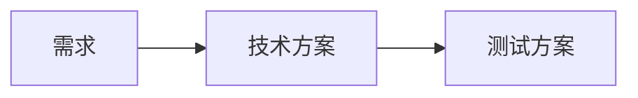
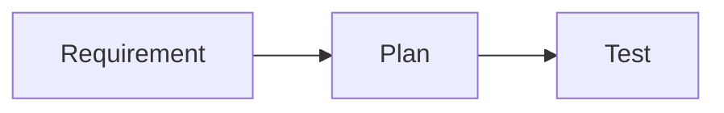
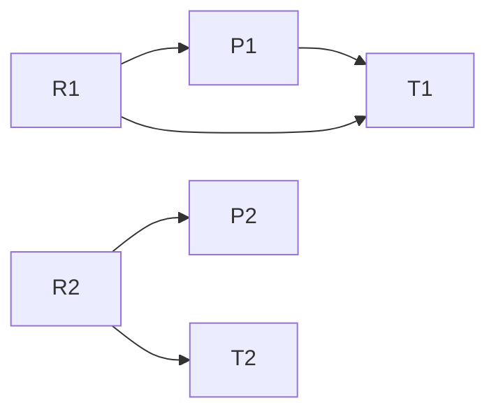

# 当代码生成不再是瓶颈：AI Coding 的下一个问题是什么？

## 引言

过去几年，AI Coding 的主要关注点集中在代码生成能力上。围绕这一目标，行业已经形成了较成熟的评测体系，例如 HumanEval、SWE-bench、LiveCodeBench、单元测试通过率、Bug Rate 以及 PR Acceptance Rate 等。这些评测方法主要回答一个问题：

> AI 是否能够正确实现代码。

然而，随着 GPT、Claude、Gemini 等大模型逐渐进入真实研发流程，AI 的职责开始从代码实现扩展到需求分析、技术方案设计、测试方案设计以及研发流程协作。此时，AI 不再只是一个代码生成工具，而是在参与工程决策。

在这种情况下，一个新的问题开始出现：

> 当 AI 开始参与需求分析和方案设计时，我们应该如何评估它的效果？

这个问题与代码生成评估存在本质差异，而现有 Benchmark 体系几乎无法直接回答。

## 问题背景

在传统的软件工程领域，代码实现通常存在较明确的正确性标准。例如一个算法问题是否通过测试集、一个接口是否满足预期行为、一个 Bug 是否被正确修复，这些问题都可以通过自动化测试得到相对客观的答案。

但对于需求分析和方案设计而言，情况并非如此。

假设存在一个业务需求，不同团队可能给出完全不同的实现方案：

- 方案 A 强调开发效率；
- 方案 B 强调系统扩展性；
- 方案 C 强调稳定性和风险控制。

这些方案可能采用不同的技术路线、承担不同的成本与风险，但最终都能够成功上线。

这意味着：

> 方案质量并不等同于代码正确性。

代码正确性更接近封闭问题，而方案设计本质上属于开放世界决策问题。在大多数业务场景下，并不存在唯一正确答案，也很难构造类似 LeetCode 或 SWE-bench 那样的标准评测集。

因此，当 AI 开始参与方案设计时，我们面临的已经不是代码评估问题，而是工程决策评估问题。

## 现有评估方式的局限

### 基于测试方案的一致性评估

一种自然的思路是让 AI 同时生成技术方案和测试方案，然后通过两者之间的一致性进行验证。

其基本流程如下：



这种方式具有较高自动化程度，但存在一个根本缺陷。

如果技术方案和测试方案都由同一个模型生成，那么实际上形成了 AI 出题、AI 答题、AI 阅卷 的闭环。

此时即使测试全部通过，也无法证明方案本身是合理的。因为测试方案可能遗漏了关键场景，而这种遗漏会被整个链路共同继承。因此测试通过只能证明方案与测试一致，而不能证明方案正确。

### 基于专家整体评审的方式

目前最可靠的方法仍然是专家评审。

但在真实项目中，专家评审往往面临另一个问题：认知负荷过高。

一个典型的方案评审过程通常包括：

1. 阅读需求背景；
2. 理解业务目标；
3. 阅读技术方案；
4. 理解设计约束；
5. 阅读测试方案；
6. 建立整体心智模型；
7. 最终形成判断。

随着需求规模增长，专家需要同时理解多个层面的信息，而这些信息之间的关系往往隐含在文档之中，并未被显式表达。因此评审成本往往并不来自判断本身，而来自于：

> 阅读、理解并建立完整心智模型的过程。

经过分析，逐渐形成一个新的认识：

> 专家评审最大的成本来源不是决策，而是认知负荷。

## 问题定义

最初本文试图解决的问题是：

> 如何自动评估方案质量？

但随着讨论深入，逐渐发现这是一个过于困难的问题。

方案质量属于开放世界问题，当前不存在统一事实（Ground Truth），也不存在被广泛接受的自动评分体系。相比之下，一个更现实的问题是：

> 如何降低方案评审的认知成本？

如果无法自动判断方案是否正确，那么是否可以帮助专家更高效地完成判断？这成为整个方案设计的出发点。

## 设计目标

基于上述分析，我们将目标定义为：

1. 降低专家建立心智模型的成本；
2. 提高需求、方案与测试之间关系的可见性；
3. 提高评审过程的可追踪性；
4. 自动发现遗漏需求、过度设计和验证缺失；
5. 保持与现有 SDD、Spec 驱动开发流程兼容。

需要特别强调的是：

> 本方案并不试图替代专家决策，而是试图降低专家完成决策所需的认知成本。

## 核心设计

经过分析，本文发现SDD研发流程中已经存在：

- Spec
- Plan
- Test

真正缺失的并不是新的文档，而是这些文档之间的显式关系。因此我们引入三个结构化模型：

- 需求点集合（Requirement Set）：用于表达需求的结构化拆解；
- 方案点集合（Plan Set）：用于表达方案的结构化拆解；
- 测试点集合（Test Set）：用于表达验证方案的结构化拆解。

例如一个复杂需求不再仅仅是一段文档，而会被拆解为：

```text
R1 R2 R3 ... Rn
```

多个边界清晰的需求点。同样，一个技术方案也会被拆解为多个独立方案点，而测试方案则被拆解为多个测试点。

### 从流程链路到关系网络

传统研发流程往往被描述为：



这种表达方式强调的是流程顺序。但对于评审而言，更重要的是这些对象之间的关系。因此我们将研发过程建模为三个集合之间的关系网络：



这里建立三类核心关系：

- 需求点与方案点的关系；
- 需求点与测试点的关系；
- 方案点与测试点的关系。

这些关系共同构成整个项目的追踪图（Traceability Graph）。

### AI 与专家的职责划分

在这一模型下，AI 与专家承担不同职责。

AI 负责：

- 提取需求点集合；
- 提取方案点集合；
- 提取测试点集合；
- 建立候选关系；
- 自动发现缺口；
- 自动发现潜在的不一致性。

例如：

- 需求没有对应方案；
- 需求没有对应测试；
- 方案没有对应需求；
- 方案没有对应测试；

这些问题都可以自动识别。

专家则负责：

- 判断需求拆解是否合理；
- 判断方案拆解是否合理；
- 判断关系映射是否合理；
- 判断风险是否被遗漏；
- 判断关键约束是否被遗漏；
- 最终确认追踪关系。

因此，专家的工作从：

> 阅读整个系统并建立完整心智模型

转变为：

> 审查结构化关系并完成验证。

### 理论依据

这一思路并非凭空产生，而是与多个成熟工程理论高度一致。

Requirements Traceability Matrix（RTM）长期用于建立需求、设计、测试与验证之间的关系，其核心目标是发现遗漏需求、过度设计以及验证缺失。现代 RTM 实践已经逐渐从静态表格演变为工具驱动的动态追踪关系管理。 [oai_citation:0‡SodiusWillert](https://www.sodiuswillert.com/en/blog/implementing-requirements-traceability-in-systems-software-engineering?utm_source=chatgpt.com)

Model-Based Systems Engineering（MBSE）强调使用模型而非文档作为核心表达载体，通过模型之间的关系来进行系统分析和验证。本方案中的需求点集合、方案点集合以及测试点集合，本质上是一种轻量化的模型表达方式。 [oai_citation:1‡Wikipedia](https://en.wikipedia.org/wiki/Model-based_systems_engineering?utm_source=chatgpt.com)

近年来 Requirements Traceability 领域也开始大量研究 AI 的应用方向。越来越多工作采用“AI 建立候选关系 + 专家最终确认”的模式，而非试图让 AI 完全替代专家。 [oai_citation:2‡SERC](https://sercuarc.org/wp-content/uploads/2025/09/Legesse_AI_Enhanced_Requirements_Traceability_Using_MBSE_LLM_Complex_Systems.pdf?utm_source=chatgpt.com)

这些研究与本文提出的方向高度一致。

### 能力边界

讨论过程中，一个重要认识逐渐形成。本方案并不试图回答以下问题：

- 需求是否正确；
- 方案是否最佳；
- 技术选型是否最优；
- 专家判断是否正确；
- 架构决策是否合理。

这些问题属于工程决策质量范畴。当前无论是 AI 还是传统软件工程方法论，都很难给出统一答案。本方案聚焦的是另一类问题：

- 需求是否被覆盖；
- 方案是否支撑需求；
- 测试是否验证方案；
- 是否存在遗漏关系；
- 是否存在过度设计；
- 是否形成完整验证闭环。

换句话说：

> 本方案关注的是追踪关系质量，而不是决策质量。

关系清晰并不意味着决策正确，但关系不清晰一定会增加决策成本。

### 分层评测体系

基于上述分析，我们将 AI Coding 评测划分为三个层次。

第一层是 Spec Validation，关注是否在做正确的事情，评估对象是需求、方案、测试及其追踪关系。

第二层是 Implementation Validation，关注是否把事情正确实现出来，主要依赖单元测试、集成测试、静态分析、CI 和代码评审。

第三层是 Production Validation，关注是否真正产生业务价值，主要依赖监控、指标、用户反馈以及业务数据。

本文讨论的内容主要位于第一层。

## 未验证假设

需要明确的是，本文提出的是一个值得验证的工程假设，而不是已经被证明有效的方法论。

其中最关键的几个假设包括：

1. 结构化关系评审是否真的比全文评审效率更高；
2. 需求点粒度如何控制；
3. AI 建立关系的质量是否足以降低专家负担；
4. 追踪关系是否能够长期维护而不会演变为新的文档负担。

这些问题仍然需要通过真实项目持续验证。

## 结论

本文并未提出一种新的 AI Coding 流程，也不试图替代现有的 SDD、Spec 驱动开发等方法论。本文认为，现有流程中真正缺失的并不是更多文档，而是文档之间显式存在的关系模型。

因此，本方案本质上更接近一种面向 AI Coding 的 Spec Validation 框架。它试图通过需求点集合、方案点集合、测试点集合以及它们之间的追踪关系，将原本依赖专家脑中隐式理解的大规模方案评审，转变为结构化、可追踪、可验证的关系评审。

AI 的价值不在于自动完成全部决策，而在于帮助人类构建模型、建立关系、发现缺口，并最终让复杂系统更容易被理解和验证。
