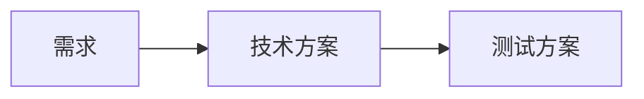
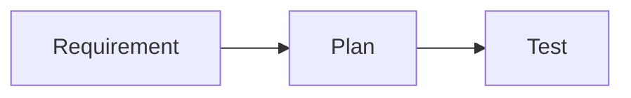
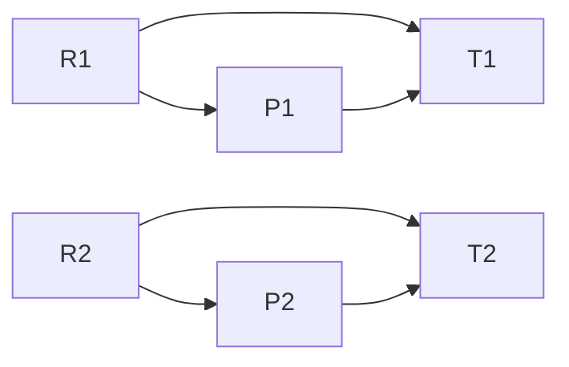
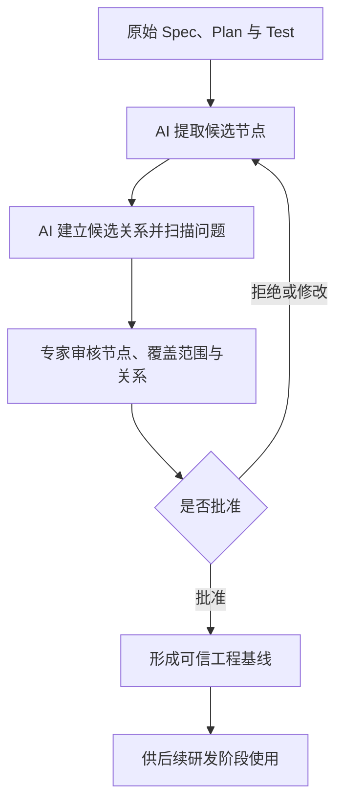

# 从生成到审核：AI Coding 中可信工程基线的构建问题

## 引言

过去几年，AI Coding 的主要关注点集中在代码生成能力上。围绕这一目标，行业已经形成了较为成熟的评测体系，例如 HumanEval、SWE-bench、LiveCodeBench、单元测试通过率、缺陷率以及 PR Acceptance Rate 等。

这些评测方法主要回答一个问题：

> AI 是否能够正确地实现代码？

然而，随着 GPT、Claude、Gemini 等大模型逐渐进入真实研发流程，AI 的职责正在从代码实现扩展到需求分析、技术方案设计、测试方案设计以及研发流程协作。AI 不再只是一个代码生成工具，而是开始参与工程产物的生成，并间接影响后续工程决策。

AI 显著降低了 Spec、Plan、Test 等研发产物的生成成本，但专家并不会因此自动获得生成过程中依赖的上下文。随着研发产物的生成速度和规模不断提高，专家需要审核的内容也可能快速增加。

因此，一个新的问题开始出现：

> 当 AI 加速研发产物生成后，专家能否以可接受的成本完成审核，并将这些产物转化为后续流程可以信任的工程基线？

这个问题与代码生成评估存在本质差异，现有以代码正确性为核心的 Benchmark 体系也很难直接回答。

## 问题背景

在传统软件工程中，代码实现通常存在较为明确的正确性标准。例如，一个算法是否通过测试集、一个接口是否满足预期行为、一个缺陷是否被正确修复，通常可以通过自动化测试得到相对客观的答案。

但对于需求分析和方案设计，情况并非如此。

假设存在一个业务需求，不同团队可能给出完全不同的实现方案：

- 方案 A 强调开发效率；
- 方案 B 强调系统扩展性；
- 方案 C 强调稳定性和风险控制。

这些方案可能采用不同的技术路线，承担不同的成本与风险，但最终都能够成功上线。

这意味着：

> 方案质量并不等同于代码正确性。

代码正确性更接近封闭问题，而需求分析和方案设计本质上属于开放世界中的工程决策问题。在大多数真实业务场景中，并不存在唯一正确答案，也很难构造类似 LeetCode 或 SWE-bench 的标准评测集。

当 AI 开始参与需求分析、技术设计和测试设计时，研发流程面临的已经不只是代码评估问题，也包括如何审核、批准和信任 AI 生成的工程产物。

## 从生成瓶颈到审核瓶颈

在传统研发流程中，编写需求、设计方案和制定测试计划本身需要投入大量时间。专家通常会在编写和讨论过程中逐渐建立对问题的心智模型。

AI 可以显著加速这些产物的生成，但不会同步降低专家完成有效审核所需的专业判断成本。专家仍然需要：

1. 理解需求背景与业务目标；
2. 判断需求是否完整、准确；
3. 理解技术方案及其约束；
4. 判断方案是否合理；
5. 理解测试与验证计划；
6. 在不同研发阶段的产物之间建立关联；
7. 判断是否可以批准相关产物。

随着 AI 生成内容的数量和复杂度增加，专家可能需要审核大量结构完整、表达流畅，但仍然可能存在遗漏、错误或错误假设的内容。

因此，AI 降低了工程产物的生成成本，却可能将流程瓶颈转移到审核、验证与可信状态建立上。

在复杂方案评审中，相当一部分成本并不来自最终批准或拒绝，而来自于拆解文档、建立跨阶段关联、寻找相关信息以及定位潜在问题的过程。

由此形成本文的核心观察：

> 当生成成本显著下降后，如何降低专家审核工程产物并建立可信基线的成本，可能成为 AI Coding 流程中的重要问题。

## 现有评估方式的局限

### 基于方案与测试一致性的评估

一种自然的思路是让 AI 同时生成技术方案和测试方案，然后通过两者之间的一致性进行验证。

其基本流程如下：



这种方式具有较高自动化程度，但存在一个根本缺陷。

如果技术方案和测试方案都由同一个模型生成，那么整个过程实际上形成了“AI 出题、AI 答题、AI 阅卷”的闭环。

即使测试全部通过，也无法证明方案本身合理。技术方案和测试方案可能共同遗漏某个关键场景，也可能共同建立在错误假设之上。

因此，测试通过只能证明实现与测试之间具有一致性，不能证明需求完整，也不能证明方案正确。

### 基于专家整体评审的方式

目前，复杂需求和技术方案最可靠的审核方式仍然是专家评审。

但传统评审通常要求专家从非结构化文档中自行提取关注点，并在需求、方案和测试之间建立关系。随着任务规模增长，专家需要同时理解多个层面的信息，而这些信息之间的关系通常隐含在不同文档中，并未被显式表达。

传统评审过程通常表现为：

```text
阅读全文
→ 自行拆解关注点
→ 在脑中建立跨文档关系
→ 寻找遗漏与冲突
→ 作出专业判断
```

专家无法将专业判断委托给 AI，但其中的信息拆解、跨文档定位、关系建立和结构完整性检查，并不一定必须完全由专家手工完成。

## 问题定义

本文最初试图解决的问题是：

> 如何自动评估技术方案质量？

但随着讨论深入，可以发现这是一个过于困难且边界不清的问题。

方案质量属于开放世界中的工程决策问题。当前不存在统一的事实标准，也不存在能够被广泛接受的自动评分体系。AI 不能可靠地替代专家判断需求是否完整、技术方案是否合理，以及风险是否可以接受。

相比之下，一个更现实的问题是：

> AI 能否帮助专家以更低的认知成本完成工程产物审核，并将审核通过的内容转化为可信、可追踪且可失效的工程基线？

本方案不试图降低专家完成专业判断本身的难度，也不试图替代专家作出最终决策。

它试图降低的是专家在进行判断之前，需要完成的信息拆解、跨文档定位、关系建立、结构检查和变更影响分析成本。

## 设计目标

基于上述问题定义，本方案将设计目标确定为：

1. 降低专家从非结构化研发产物中提取关注点的成本；
2. 降低专家在需求、方案和测试之间建立关联的成本；
3. 提高跨阶段研发关系的可见性与可追踪性；
4. 帮助专家发现没有建立映射的节点和潜在不一致；
5. 降低追踪关系首次建立和持续维护的成本；
6. 将专家批准结果转化为可追踪、可失效的可信基线；
7. 保持与现有 SDD、Spec 驱动开发和代码评审流程兼容。

需要特别强调的是：

> 本方案不试图替代专家决策，而是试图降低专家完成决策所需的准备、关联和验证成本。

## 核心设计

现有 SDD 和 Spec 驱动研发流程中通常已经存在以下产物：

- Spec；
- Plan；
- Test。

真正缺失的通常不是更多文档，而是这些研发产物之间显式存在的结构与关系。

因此，本方案首先引入三个结构化集合：

- 需求点集合（Requirement Set），用于表达经过拆解的候选需求点；
- 方案点集合（Plan Set），用于表达经过拆解的候选方案点；
- 测试点集合（Test Set），用于表达经过拆解的候选测试与验证点。

例如，一个复杂需求不再只被视为一段完整文档，而会被 AI 拆解为：

```text
R1, R2, R3, ... Rn
```

技术方案会被拆解为：

```text
P1, P2, P3, ... Pn
```

测试方案会被拆解为：

```text
T1, T2, T3, ... Tn
```

这些节点并不是由 AI 自动确认的事实，而是供专家审核的候选结构化表达。每个节点都应当保留与原始文档之间的可追溯关系，使专家能够随时返回原文进行核对。

## 从流程链路到关系网络

传统研发流程通常被描述为：



这种表达强调的是研发阶段的执行顺序。

但对于审核而言，更重要的是不同阶段产物之间的具体关系。因此，本方案将研发过程建模为多个结构化集合之间的关系网络：



其中主要包括三类候选关系：

- 需求点与方案点之间的关系；
- 需求点与测试点之间的关系；
- 方案点与测试点之间的关系。

这些关系共同构成项目的追踪图（Traceability Graph）。

追踪图并不证明需求完整、方案合理或测试充分。它的作用是将原本隐含在不同文档中的关系显式呈现，帮助专家更高效地完成审核。

## AI 与专家的职责划分

在这一模型下，AI 与专家承担不同职责，并具有明确的信任边界。

AI 负责：

- 从原始材料中提取候选需求点、方案点和测试点；
- 建立候选追踪关系；
- 发现没有建立映射的节点；
- 标记存在歧义、冲突或低置信度的关系；
- 对候选节点和关系执行初步问题扫描；
- 在来源发生变化后，识别可能受到影响的节点和关系；
- 提出关系新增、修改、失效或删除建议。

专家负责：

- 判断候选节点是否准确表达原始材料；
- 判断需求集合是否合理覆盖原始需求与现实问题；
- 判断方案和测试内容是否合理；
- 判断候选关系是否成立；
- 判断是否存在 AI 未能识别的重要内容；
- 批准、拒绝或修改候选节点和关系；
- 最终形成后续流程可以使用的可信基线。

AI 负责降低结构化和关联成本，但不能直接决定其生成结果是否可信。专家仍然是工程判断和批准行为的责任主体。

## 信任模型：专家批准形成可信基线

AI 生成的节点、关系和问题提示默认都只是候选内容。它们不能因为表达完整、关系闭合或者形式一致，就直接进入后续决策链。

整个信任形成过程可以表示为：



专家批准并不意味着相关内容成为客观且永久正确的事实。它表示：

> 在当前信息、版本、约束和责任边界下，相关内容已经完成审核，可以作为后续研发阶段的有效输入。

这与传统软件工程中的需求基线、设计评审、ADR、代码评审和上线审批具有相似性质。

因此，更准确的概念不是“事实”，而是：

- 已批准产物（Approved Artifact）；
- 可信工程基线（Trusted Engineering Baseline）；
- 已验证项目状态（Validated Project State）。

信任不来自 AI 的生成质量，也不来自追踪图的形式完整性，而来自可追溯的专家批准，以及批准所依赖的来源仍然有效。

## 可信状态与失效机制

为了保证可信基线能够长期使用，系统需要明确管理节点和关系的状态。

至少应当包含以下状态：

- `Proposed`：由 AI 提出，尚未完成专家审核；
- `Approved`：已经由专家批准，可以作为当前可信基线的一部分；
- `Rejected`：已经被专家拒绝；
- `Stale`：来源发生变化，原批准结果可能不再有效；
- `Superseded`：已经被新版本替代。

当原始需求、技术方案、测试计划或其他依赖来源发生变化时，系统应当识别可能受影响的节点和关系，并将相关批准状态标记为 `Stale`。

随后，AI 可以提出增量更新建议，由专家重新审核受影响部分，而不需要重新审核整张追踪图。

完整运行闭环如下：

```text
原始研发产物
→ AI 生成候选节点与关系
→ AI 执行问题扫描
→ 专家审核并批准
→ 形成可信基线
→ 后续流程使用可信基线
→ 来源发生变化
→ 受影响内容进入 Stale 状态
→ AI 提出增量更新建议
→ 专家执行增量审核
→ 形成新的可信基线
```

## AI 辅助问题扫描

为了进一步降低专家寻找问题的成本，AI 可以在专家正式审核前执行一次问题扫描，并优先呈现可能需要关注的区域。

问题扫描可以包括：

- 没有对应方案关系的需求点；
- 没有对应验证关系的需求点；
- 没有明确需求来源的方案点；
- 没有验证方式的方案点；
- 存在歧义或多种可能映射方式的节点；
- AI 无法稳定建立关系的内容；
- 来源变化后可能已经失效的节点和关系；
- 与上一版本相比发生明显变化的区域。

这些提示不是审核结论，也不能直接证明存在遗漏需求、过度设计或错误方案。它们只是用于帮助专家分配注意力、定位潜在问题并提高审核效率。

专家不能只审核 AI 标记的问题区域。对于未被标记的内容，仍然需要完成必要的覆盖确认。

## 方案关注的是评审成本，而不是自动正确性

本方案不试图回答以下问题：

- 需求是否客观正确；
- 所有重要需求是否已经被识别；
- 技术方案是否最佳；
- 技术选型是否最优；
- 专家判断是否一定正确；
- 测试是否能够证明系统绝对可靠。

这些问题属于工程决策质量范畴。当前无论是 AI 还是传统软件工程方法，都很难提供统一且自动化的答案。

本方案关注的是另一类问题：

- 专家能否更高效地理解需要审核的对象；
- 不同研发阶段的产物之间是否建立了显式关系；
- 是否存在没有建立映射的节点；
- 专家能否快速定位需要重点判断的区域；
- 已批准内容是否能够作为后续流程的可信输入；
- 来源变化后，相关批准是否能够及时失效并重新审核。

换句话说：

> 本方案关注的不是如何替代专家判断，而是如何降低专家形成有效判断并建立可信基线的成本。

## R/P/T 是最小可验证模型

真实工程决策通常还涉及约束、风险、假设、证据、替代方案和决策记录等对象。

这些对象可能包括：

- Constraint；
- Risk；
- Assumption；
- Evidence；
- Alternative；
- Decision。

但是，本文并不试图在初始阶段构建完整的工程知识图谱。

R/P/T 对应研发流程中三个最基础的问题：

- `R`：准备解决什么问题；
- `P`：准备如何解决问题；
- `T`：准备如何验证结果。

因此，R/P/T 可以作为用于验证核心假设的最小模型。其他节点类型可以根据真实项目中的高频需求逐步加入，但不会改变以下核心机制：

```text
非结构化研发产物
→ AI 生成候选结构
→ AI 建立候选关系
→ 专家审核
→ 形成可信基线
```

优先验证最小模型能否降低专家审核成本，比一开始构建完整模型更加现实。

## 理论与工程基础

这一思路并非凭空产生，而是与多个成熟的软件工程和系统工程实践高度一致。

Requirements Traceability Matrix（RTM）长期用于建立需求、设计、实现与验证之间的关系，其核心目标包括发现覆盖缺口、支持变更影响分析以及提供审计依据。

Model-Based Systems Engineering（MBSE）强调使用模型和关系表达系统，而不是仅依赖彼此独立的文档。本文提出的需求点、方案点、测试点以及追踪关系，可以视为一种轻量化的模型表达方式。

传统追踪方法的主要限制并不是缺乏价值，而是首次建立关系和持续维护关系的成本过高。因此，这类方法通常更常见于高风险、强监管或复杂系统工程项目。

本方案最关键的工程假设是：

> AI 可以将追踪关系的建立与维护，从人工逐条处理的高成本活动，转化为 AI 提出候选结构和增量变更、专家完成审核与批准的低成本活动。

如果这一假设成立，过去主要用于高风险项目的工程追踪实践，可能以可接受的成本进入普通 AI Coding 工作流。

## 分层评测体系

随着 AI 参与研发流程的范围扩大，AI Coding 的评测也需要从单一代码正确性评测扩展为分层体系。

### 第一层：Spec Validation

Spec Validation 关注需求、方案、测试以及它们之间的关系，主要回答：

- 研发产物是否经过有效审核；
- 不同阶段产物之间是否建立显式关系；
- 是否形成可供后续流程使用的可信基线；
- 变更发生后，相关影响是否能够被追踪。

本文讨论的内容主要位于这一层。

### 第二层：Implementation Validation

Implementation Validation 关注方案是否被正确实现，主要依赖：

- 单元测试；
- 集成测试；
- 静态分析；
- CI；
- 代码评审；
- 安全扫描。

这一层主要回答：

> 是否正确地实现了已经批准的方案？

### 第三层：Production Validation

Production Validation 关注系统是否在真实环境中产生预期结果，主要依赖：

- 生产监控；
- 业务指标；
- 用户反馈；
- 稳定性数据；
- 安全事件；
- 实际运营结果。

这一层主要回答：

> 已批准并实现的方案，是否真正产生了预期价值？

三层评测无法相互替代。Spec Validation 不能证明实现正确，Implementation Validation 不能证明业务目标正确，Production Validation 也不能替代前期工程治理。

## 未验证假设

本文提出的是一个值得验证的工程假设，而不是已经被证明有效的方法论。

其中最关键的假设包括：

1. AI 生成的候选节点和关系是否能够显著降低专家的信息拆解与跨文档关联成本；
2. 结构化关系辅助评审是否能够在不降低审核质量的情况下减少审核时间；
3. R/P/T 节点的粒度应当如何控制；
4. AI 建立候选关系的质量是否足以降低专家负担；
5. 专家审核候选结构的成本是否低于自行建立结构的成本；
6. AI 是否能够有效支持追踪关系的增量维护；
7. 追踪关系是否能够长期保持有效，而不会演变为新的文档负担；
8. 专家是否可能因为追踪图形式完整而产生错误信任。

这些问题需要通过真实项目和对照实验持续验证。

## 评估方式

为了验证方案是否有效，可以比较以下两种评审方式：

```text
A 组：专家直接阅读原始 Spec、Plan 和 Test 并完成审核

B 组：专家阅读原始材料，并使用 AI 生成的候选节点、
候选关系和问题扫描结果辅助审核
```

可以重点测量以下指标：

- 专家完成审核所需时间；
- 专家发现真实问题的数量；
- 问题漏检率与误报率；
- 专家修改 AI 候选节点和关系的比例；
- AI 错误建议被专家批准的比例；
- 专家主观认知负荷；
- 从原文定位相关内容所需时间；
- 需求变化后的影响定位和增量审核时间；
- 追踪关系在一段时间后的失效率；
- 专家是否因结构完整而产生错误信任。

该方案最重要的成功标准是：

> 在不降低专家审核质量的情况下，显著减少完成审核并形成可信工程基线所需的时间与认知负荷。

## 方案边界与适用范围

该方案并不适用于所有研发任务。

对于简单、低风险和影响范围有限的代码修改，直接审核代码和测试可能比建立结构化追踪关系更加高效。

随着以下因素增加，该方案的潜在价值也会提高：

- 任务涉及多个模块或团队；
- 需求和业务规则复杂；
- Spec、Plan 和 Test 由不同 Agent 或不同阶段生成；
- 需求频繁变化；
- 系统需要审计、责任追踪或长期维护；
- 项目风险较高；
- AI 大量参与需求、方案、实现和测试生成。

因此，系统应当根据任务复杂度、风险和治理要求决定是否启用追踪性审核，而不应将其强制应用于所有开发任务。

## 结论

当 AI 开始快速生成 Spec、Plan、Test 和代码时，研发流程中的主要约束将不再只来自生成能力，也来自人类能否高效审核、批准并信任这些产物。

本文并未提出一种由 AI 自动评估方案质量的方法，也不试图替代专家完成工程判断。本文提出的是一种面向 AI Coding 的专家决策支持与可信基线构建机制。

其核心过程可以概括为：

```text
AI 提取候选节点
+ AI 建立候选关系并扫描问题
+ 专家审核节点、覆盖范围和关系
+ 专家批准后形成可信基线
+ 来源变化后执行增量失效与重新审核
```

在这一机制中，AI 的价值不在于自动完成全部决策，而在于帮助专家拆解信息、建立关联、发现潜在问题并维护追踪关系。

专家仍然负责判断需求是否完整、方案是否合理、测试是否充分，并通过批准行为为后续流程建立可信边界。

本方案最关键的假设是：AI 能够将过去昂贵的追踪关系建立和维护工作，转化为低成本的候选生成与专家增量审批活动。

如果这一假设能够在真实项目中得到验证，那么 AI 的价值将不仅体现在加速研发产物生成，也体现在帮助人类以可接受的成本完成审核、治理与可信工程状态构建。

换句话说：

> 当生成不再昂贵，真正稀缺的将是有效审核与可信批准。

如何利用 AI 降低这一过程的成本，可能是 AI Coding 在代码生成能力之外值得持续研究的重要问题。
